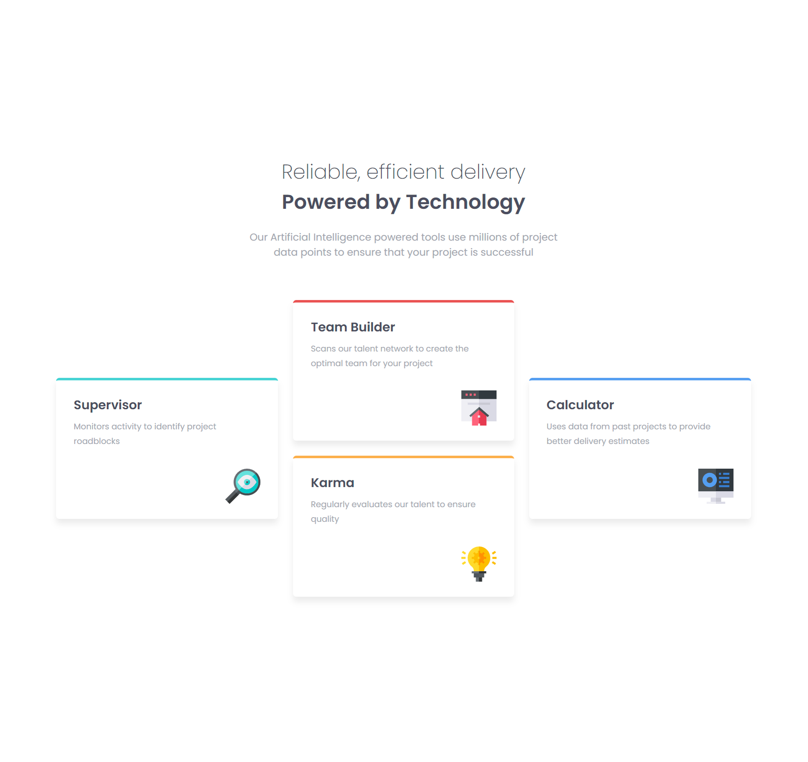

# Frontend Mentor - Four card feature section solution

This is a solution to the [Four card feature section challenge on Frontend Mentor](https://www.frontendmentor.io/challenges/four-card-feature-section-weK1eFYK). Frontend Mentor challenges help you improve your coding skills by building realistic projects. 

## Table of contents

- [Overview](#overview)
  - [The challenge](#the-challenge)
  - [Screenshot](#screenshot)
  - [Links](#links)
- [My process](#my-process)
  - [Built with](#built-with)
  - [What I learned](#what-i-learned)
  - [Continued development](#continued-development)
  - [Useful resources](#useful-resources)
- [Author](#author)

**Note: Delete this note and update the table of contents based on what sections you keep.**

## Overview

### The challenge

Users should be able to:

- View the optimal layout for the site depending on their device's screen size

### Screenshot

### Links

- Solution URL: [https://github.com/antoniomontoia/four-card-feature-section-master]
- Live Site URL: [https://antoniomontoia.github.io/four-card-feature-section-master/]

## My process

### Built with

- Semantic HTML5 markup
- CSS custom properties
- Flexbox
- Mobile-first workflow

### What I learned

I solidified my knowledge of Flexbox by effectively using the flex property to create responsive layouts that adapt to different screen sizes.

I put SASS to good use, which helped me structure my CSS more efficiently and maintain a clean, organized codebase through the use of variables, nesting, and mixins.

I gained experience in implementing responsive design principles, ensuring that the layout looks great on various devices and screen sizes.

I practiced debugging and troubleshooting layout issues, enhancing my problem-solving skills in web development.

### Continued development

In future projects, I would like to focus on the following areas:

Refining Flexbox Skills: I aim to continue trimming my knowledge of Flexbox, exploring more advanced techniques and use cases to create even more complex and responsive layouts.

Deepening CSS Grid Understanding: I want to delve deeper into CSS Grid, learning how to leverage its capabilities for creating intricate grid-based layouts. I plan to experiment with grid templates, areas, and responsive design techniques to enhance my layout skills.

### Useful resources

- [CSS Grid Garden](https://cssgridgarden.com) - This helped me getting started with CSS Grid. Even if it was not necessary for this project, I highly recommend it.
- [Flexbox Zombies](https://mastery.games/flexboxzombies) - This is an amazing way of solidifying flexbox knowledge.

## Author

- Frontend Mentor - [@antoniomontoia](https://www.frontendmentor.io/profile/antoniomontoia)
- Dribble - [@franissimo](https://www.twitter.com/franissimo)